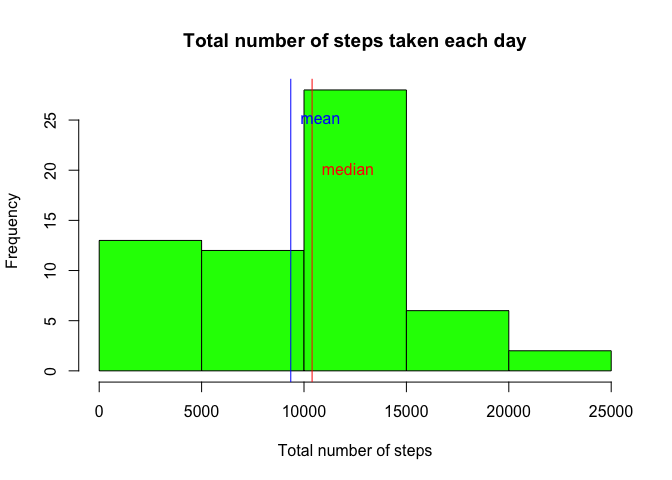
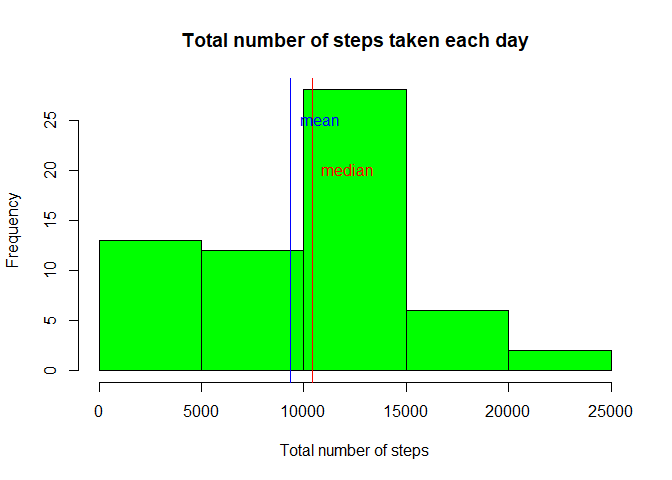
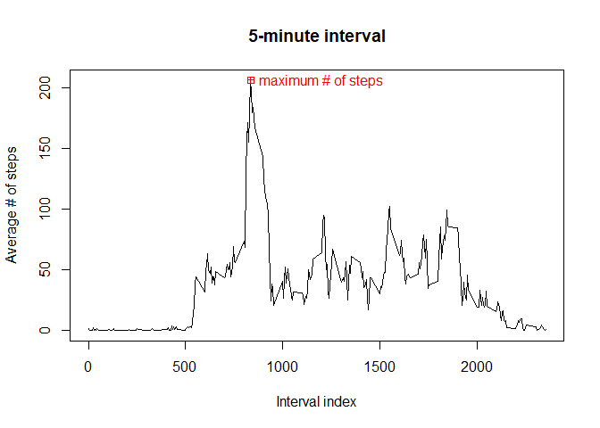
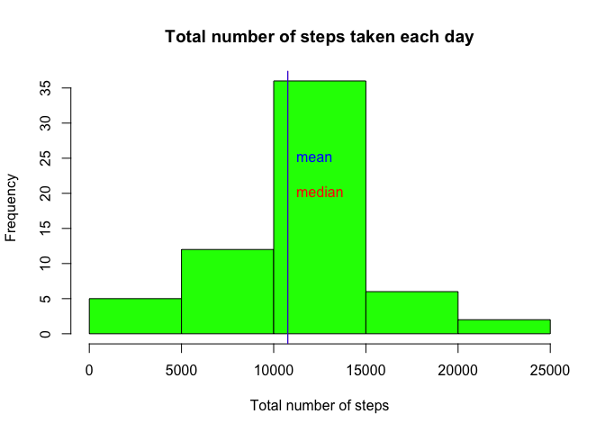
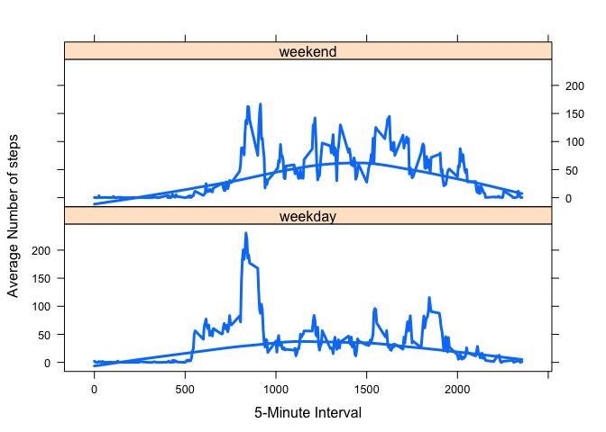

# Reproducible Research: Peer Assessment 1

## Loading and preprocessing the data

```r
activity<-read.csv("activity.csv")
library(dplyr)
```

```
## 
## Attaching package: 'dplyr'
```

```
## The following objects are masked from 'package:stats':
## 
##     filter, lag
```

```
## The following objects are masked from 'package:base':
## 
##     intersect, setdiff, setequal, union
```

```r
library(lattice)
```
Convert date type into POSIXct type

```r
activity$date <- as.POSIXct(activity$date)
```
# What is mean total number of steps taken per day?

##1. Calculate the total number of steps taken per day, save to *a*

```r
activity %>% group_by(date) %>% summarise(total_step = sum(steps, na.rm = TRUE)) ->a
```
##2. Make a histogram of the total number of steps taken each day
##3. Calculate and report the mean and median of the total number of steps taken per day


```r
hist(a$total_step,col="green",main="Total number of steps taken each day",xlab="Total number of steps")
abline(v=median(a$total_step), col="red")
abline(v=mean(a$total_step),col="blue")
text(mean(a$total_step),25,labels="mean", pos=4, col="blue")  
text(median(a$total_step),20,labels="median", pos=4, col="red")  
```

<!-- -->


# What is the average daily activity pattern?

##1. Make a time series plot (i.e. type = "l") of the 5-minute interval (x-axis) and the average number of steps taken, averaged across all days (y-axis)


```r
activity %>% group_by(interval) %>% summarise(avg_step = mean(steps, na.rm = TRUE)) ->b

plot(b$interval,b$avg_step, type="l", ylab="Average # of steps", xlab="Interval index", main="5-minute interval")
y<-max(b$avg_step)
x<-subset(b,avg_step==y, select="interval")
points(x,y,col="red",pch=12)
text(x,y,labels="maximum # of steps", pos=4, col="red")  
```

<!-- -->


##2. Which 5-minute interval, on average across all the days in the dataset, contains the maximum number of steps?

        Interval 835 on average across all the days contains the maximum number of steps 206.1698113. 


# Imputing missing values

##1. Calculate and report the total number of missing values in the dataset (i.e. the total number of rows with NAs)

```r
activity %>% group_by(na=is.na(steps)) %>% summarise(count = n()) ->c
barplot(c$count,names.arg=c("Not NA","NA"),ylim=range(0,nrow(activity)))

na <- subset(c, na,select="count")                     
notna <- subset(c, !na,select="count")    
text(.7,0,labels=notna, pos=3)                                           
text(1.9,0,labels=na, pos=3)
```

<!-- -->


##2. Devise a strategy for filling in all of the missing values in the dataset. I'll use the average number of steps taken, averaged across all days (y-axis) to impute the missing values at each correspoinding interval.
##3. Create a new dataset dfinal that is equal to the original dataset but with the missing data filled in.


```r
merge(activity, b, by="interval") -> d
d[is.na(d["steps"]),]->d1
mutate(d1,steps=avg_step)->d1m
d[!is.na(d["steps"]),]->d2
rbind(d1m,d2)->dfinal
```


##4. Make a histogram of the total number of steps taken each day and Calculate and report the mean and median total number of steps taken per day

```r
dfinal %>% group_by(date) %>% summarise(total_step = sum(steps, na.rm = TRUE)) ->dfinal2

hist(dfinal2$total_step,col="green",main="Total number of steps taken each day",xlab="Total number of steps")
abline(v=median(dfinal2$total_step), col="red")
abline(v=mean(dfinal2$total_step),col="blue")

text(mean(dfinal2$total_step),25,labels="mean", pos=4, col="blue")  
text(median(dfinal2$total_step),20,labels="median", pos=4, col="red")  
```

<!-- -->

Please note that the red line of median and blue line of mean are overlapped now.That's why the
blue line has covered the red line.


##Do these values differ from the estimates from the first part of the assignment? 
        
        

```r
summary(dfinal2)
```

```
##       date                       total_step   
##  Min.   :2012-10-01 00:00:00   Min.   :   41  
##  1st Qu.:2012-10-16 00:00:00   1st Qu.: 9819  
##  Median :2012-10-31 00:00:00   Median :10766  
##  Mean   :2012-10-31 00:25:34   Mean   :10766  
##  3rd Qu.:2012-11-15 00:00:00   3rd Qu.:12811  
##  Max.   :2012-11-30 00:00:00   Max.   :21194
```

```r
summary(a)
```

```
##       date                       total_step   
##  Min.   :2012-10-01 00:00:00   Min.   :    0  
##  1st Qu.:2012-10-16 00:00:00   1st Qu.: 6778  
##  Median :2012-10-31 00:00:00   Median :10395  
##  Mean   :2012-10-31 00:25:34   Mean   : 9354  
##  3rd Qu.:2012-11-15 00:00:00   3rd Qu.:12811  
##  Max.   :2012-11-30 00:00:00   Max.   :21194
```

Yes. The mean and median shift to right and the number of days that the person walks from 0 to 15000 steps increases. This is because that we impute the NA values with average number of steps at each interval.

        
##What is the impact of imputing missing data on the estimates of the total daily number of steps?

Increase the number of days that the person walks from 0 to 15000 steps, closer to the average steps walked per day.


# Are there differences in activity patterns between weekdays and weekends?

##1. Create a new factor variable in the dataset with two levels – “weekday” and “weekend” indicating whether a given date is a weekday or weekend day.


```r
##dfinal -> wd
##wd$weekday <- weekdays(wd$date)
##for (i in 1:nrow(wd)) {                                       
##    if (wd[i,]$weekday %in% c("Saturday","Sunday")) {            
##        wd[i,]$weekday<-"weekend"                                 
##    }
##    else{
##        wd[i,]$weekday<-"weekday"                                 
##    }
##}
##wd$weekday <- as.factor(wd$weekday)
##wd->wdfinal

##Not using the above code because the performance is too low


mutate(dfinal, weekday=weekdays(date))-> wd
wd[wd["weekday"] == "Saturday" | wd["weekday"] =="Sunday",]->weekend
mutate(weekend, weekday="weekend")-> weekend
wd[wd["weekday"]!="Saturday" & wd["weekday"]!="Sunday",]->weekday
mutate(weekday, weekday="weekday")-> weekday
rbind(weekday,weekend)->wdfinal

wdfinal$weekday <- as.factor(wdfinal$weekday)
```

##2. Make a panel plot containing a time series plot (i.e. type = "l") of the 5-minute interval (x-axis) and the average number of steps taken, averaged across all weekday days or weekend days (y-axis).

```r
wdfinal %>% group_by(interval, weekday) %>% summarise(avg_step = mean(steps, na.rm = TRUE)) ->wdfinal2


xyplot(avg_step ~ interval | weekday ,wdfinal2, ylab="Average Number of steps", xlab="5-Minute Interval",layout=c(1,2), type=c('l','smooth'), lwd=3)
```

<!-- -->


        As the plot shows, the individual works out more at weekend then weekdays in general, and less around 8 a.m.at weekend than during weekdays.


